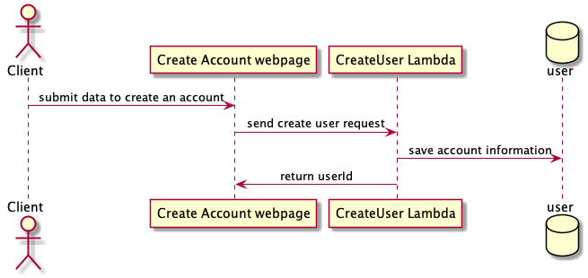
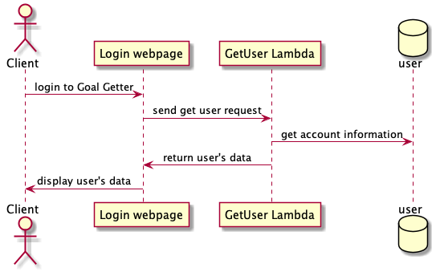
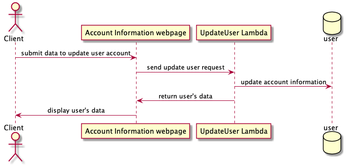
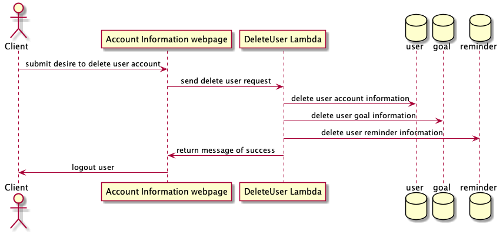
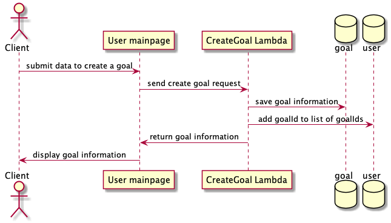
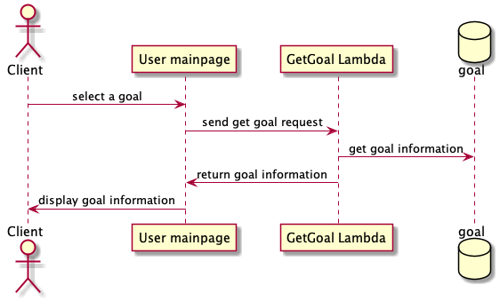
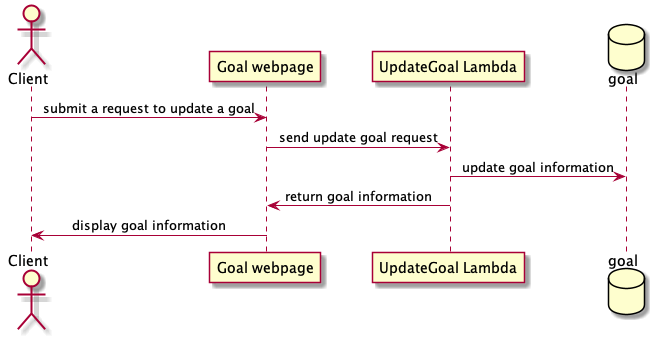
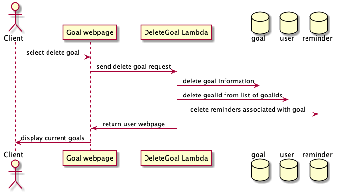
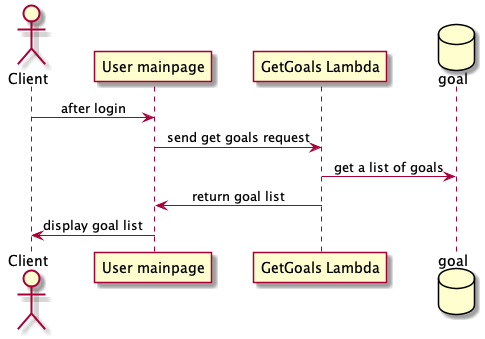

# Goal Getter

## 1. Problem Statement  

Some of the most successful people in the world set goals and usually their success depends on how well they can achieve those goals. **Goal Getter** is an application that will help people keep track of their goals and give them timely reminders to encourage them to keep working towards achieving those goals. Most of us want to be successful in life in whatever way we define that for our life, and **Goal Getter** will help each person achieve success through these core features:
 

1. The ability to set goals and track progress
2. Reminders to help achieve goals
3. Encouragement and motivation
4. A community of goal-setters to interact with and learn from
5. Tips and resources to help accomplish goals
 

Only you can determine what you want to strive for, but once you figure out your goals and can identify the steps along the goal achievement path, then that's where **Goal Getter** comes in. We want to help you accomplish your goals and achieve success and become a Goal Getter!

## 2. Top Questions To Resolve in Review

## 3. Use Cases

U1. As a user, I want to create a new account, so I can create new goals and track their progress.

U2. As a user, I want to login to my account, so I can see my goals and their progress.

U3. As a user, I want to logout of my account, so when I am finished checking my goal progress that no one else can see my data.

U4. As a user, I want to delete my account, so if I decided that I don't want to set goals I can remove my account and data.

U5. As a user, I want to edit my account, so if some information/data changes that I can make that change to my account.

U6. As a user, I want to create a new goal, so that I can start tracking my progress of accomplishing this goal.

U7. As a user, I want to edit a goal, so if I make a mistake or something changes I can make those edits to my goal.

U8. As a user, I want to create markers/steps for each goal, so that I can break down a goal further down into smaller achievable steps.

U9. As a user, I want to update a goal marker/step, so that as I achieve steps of my goal I can check those off and see the progress.

U10. As a user, I want to delete a goal, so that if I no longer want to have a certain goal I can remove it from my goals to achieve.

U11. As a user, I want to toggle reminders on or off for a goal, so that I can have control over if I get reminded about a goal.

U12. As a user, I want to share my goals with friends/family, so that I can hold myself accountable.

## 4. Project Scope

    <h3>4.1 In Scope</h3>
    

    - Creating, retrieving, updating, and deleting an account.  
    - Creating, retrieving, updating, and deleting goals.  
    - Sending email/text message reminders to a user.  
    - Share a goal and it's progress with an external user  
    

    <h3>4.2 Out of Scope</h3>
    

    - Using Alexa, Google Home, Siri to create or track goal progress
    - A dedicated mobile application (iOS/Android)  
    - Community features that allow users to interact with each other 
    - Support features that give users tips on how to achieve their goals 
    - A way for you users to bet on themselves to accomplish goals 
    

## 5. Proposed Architecture Overview

This initial iteration will provide the minimum viable product (MVP) including creating, retrieving, updating, and deleting an account, as well as creating, retrieving, updating, and deleting a goal. Furthurmore, a user will also be able to get timely encouraging reminders to help motivate them to achieve their goals.

We will use API Gateway and Lambda to create the endpoints needed to accomplish all the tasks to have a functioning application as layed out above. These endpoints include:

|             |              |
|:------------|:-------------|
| `CreateUser`| `CreateGoal` |
| `GetUser`   | `GetGoal`    |
| `UpdateUser`| `UpdateGoal` |
| `DeleteUser`| `DeleteGoal` |

We will store all data in a DynamoDb tables which will include `'user'` and `'goal'`, and `'reminder`'. **Goal Getter** will also provide a web application to allow users to manager their account. A main page will provide them with all their goals and will give them the ability to create, update, or delete any of their current goals.

## 6. API

    <h3>6.1 Public Models</h3>
<pre>
    // User
    String userId;
    String username;
    String hashedPassword;
    String salt;
    String email;
    String phoneNumber;
    String birthDate;
    String dateAccountCreated;
    List< UpdateLog > changeLog;
    List< String > ipAddresses;
    Boolean canReceiveTexts;
    Boolean isVerified;
    List< String > goalIds;
</pre>
<pre>
    // Goal
    String goalId;
    String userId;
    String typeOfGoal;
    String description;
    String dateCreated;
    String dateToBeAchievedBy;
    String dateAchievedBy;
    List< GoalStep > goalSteps;
    Boolean remindersOn;
    Boolean goalFinished;
    Integer priority;
    Integer goalDifficulty;
</pre>
<pre>
    // GoalStep
    String goalStepId;
    String goalId;
    String userId;
    String stepDescription;
    String dateCreated;
    String dateToBeAchievedBy;
    String dateAchievedBy;
    Integer stepDifficulty;
    Boolean canSendReminders;
    Boolean isGoalStepFinished;
</pre>
<pre>
    // Reminder
    String reminderId;
    String reminderType; // i.e. Goal, GoalStep, or other
    String goalId;
    String goalStepId;
    String userId;
    String message;
    Boolean canSendText;
    Boolean canSendEmail;
    String dateToSendReminder;
    String dateReminderSent;
    Boolean requiresUserFeedback; // If it this reminder needs input from user (i.e. goal/step will expire)
</pre>
<pre> 
    // UpdateLog
    String updateLogId;
    String userId;
    String dateOfUpdate;
    String previousState;
    String newState;
</pre>
    <h3>6.2 Create User Endpoint</h3>
    

        - Accepts <code>POST</code> requests to <code>/users</code> 
        - Accepts data to create a new account with a provided email address, username, and password.  
          &nbsp;&nbsp;&nbsp;&nbsp;Returns a new user account with a unique userId assigned by <strong>Goal Getter</strong>. 
        - Each data input sent will be validated to make sure that no malformed data is being sent. If any data is deemed to be  
        &nbsp;&nbsp;&nbsp;&nbsp;malformed, then a <code>InvalidAttributeValueException</code> will be thrown.
    

    
     
    <h3>6.3 Get User Endpoint</h3>
    

        - Accepts <code>GET</code> requests to <code>/users/:userId</code> 
        - Accepts a userId and returns the data corresponding to that user.  
        - If the given userId is not found, then a <code>UserNotFoundException</code> will be thrown.
    

    
     
    <h3>6.4 Update User Endpoint</h3>
    

        - Accepts <code>PUT</code> requests to <code>/users/:userId/update</code> 
        - Accepts data to update/edit a user account with optional data inputs (i.e. dateOfBirth, phoneNumber, etc)  
        &nbsp;&nbsp;&nbsp;&nbsp;and returns the updated user account. 
        - Each data input sent will be validated to make sure that no malformed data is being sent. If any data is deemed to be  
        &nbsp;&nbsp;&nbsp;&nbsp;malformed, then a <code>InvalidAttributeValueException</code> will be thrown.
    

    
     
    <h3>6.5 Delete User Endpoint</h3>
    

        - Accepts <code>POST</code> requests to <code>/users/:userId/delete</code> 
        - Accepts a userId and returns a message of success if the user's account is deleted. 
        - If the given userId is not found, then a <code>UserNotFoundException</code> will be thrown.
    

    
     
    <h3>6.6 Create Goal Endpoint</h3>
    

        - Accepts <code>POST</code> requests to <code>/users/:userId/goals</code> 
        - Accepts a userId and data to create a new goal (See public models to see all data).  
          &nbsp;&nbsp;&nbsp;&nbsp;Returns a new goal with a unique goalId assigned by <strong>Goal Getter</strong>. 
        - Each data input sent will be validated to make sure that no malformed data is being sent. If any data is deemed to be  
        &nbsp;&nbsp;&nbsp;&nbsp;malformed, then a <code>InvalidAttributeValueException</code> will be thrown.
    

    
     
    <h3>6.7 Get Goal Endpoint</h3>
    

        - Accepts <code>GET</code> requests to <code>/users/:userId/goals/:goalId</code> 
        - Accepts a userId and goalId and returns the data corresponding to that goal.  
        - If the given userId is not found, then a <code>UserNotFoundException</code> will be thrown. 
        - If the given goalId is not found, then a <code>GoalNotFoundException</code> will be thrown.
    

    
     
    <h3>6.8 Update Goal Endpoint</h3>
    

        - Accepts <code>PUT</code> requests to <code>/users/:userId/goals/:goalId/update</code> 
        - Accepts data to update/edit a goal with optional data inputs (i.e. description, dateToBeAchieved, etc)  
        &nbsp;&nbsp;&nbsp;&nbsp;and returns the updated goal. 
        - Each data input sent will be validated to make sure that no malformed data is being sent. If any data is deemed to be  
        &nbsp;&nbsp;&nbsp;&nbsp;malformed, then a <code>InvalidAttributeValueException</code> will be thrown.
    

    
     
    <h3>6.9 Delete Goal Endpoint</h3>
    

        - Accepts <code>POST</code> requests to <code>/users/:userId/goals/:goalId/delete</code> 
        - Accepts a goalId and userId and returns a message of success if the goal is deleted. 
        - If the given userId is not found, then a <code>UserNotFoundException</code> will be thrown. 
        - If the given goalId is not found, then a <code>GoalNotFoundException</code> will be thrown.
    

    
     
    <h3>6.10 Get Goals Endpoint</h3>
    

        - Accepts <code>GET</code> requests to <code>/users/:userId/goals</code> 
        - Accepts a userId and returns a list of all the user's goals.  
        - If the given userId is not found, then a <code>UserNotFoundException</code> will be thrown. 
    

    

